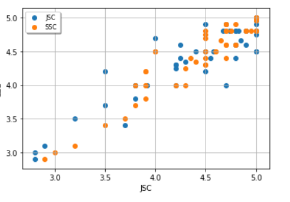

# HSC Result
 
HSC result 2020 prediction using machine mearning
 
<b>Algorithm </b> Linear Regression
 
<b>Library required </b>
<ol>
<li>Numpy</li>
 <li>Matpplotlib</li>
 <li>Pandas</li>
</ol>

model.predict([['JSC','SSC']) -> HSC Result

